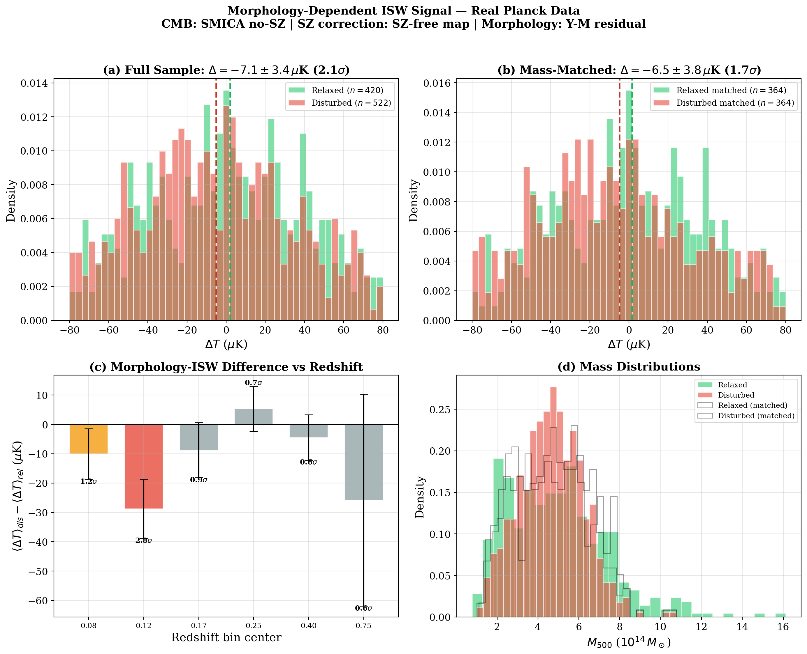

# Cluster Morphology as a Systematic in ISW Measurements

**First test of morphology-dependent ISW signal using 942 Planck SZ clusters and SZ-free CMB maps.**



## Key Finding

Disturbed galaxy clusters show systematically **colder** CMB temperatures than relaxed clusters on the Planck SZ-free SMICA map — the **opposite** of what standard ΛCDM predicts. The effect survives mass matching and is concentrated at low redshift, consistent with the [Hansen et al. (2026)](https://arxiv.org/abs/2506.08832) ISW anomaly.

| Analysis | ΔT (μK) | Significance | p-value |
|----------|---------|-------------|---------|
| **Full sample** (n=942) | −7.1 ± 3.4 | **2.1σ** | 0.037 |
| **Mass-matched** (364 pairs) | −6.5 ± 3.8 | **1.7σ** | 0.087 |
| **Regression** (controlling M, z) | −16.6 ± 9.3 | **1.8σ** | 0.073 |
| **z = 0.10–0.15 bin** | −28.7 | **2.8σ** | 0.006 |

## What This Means

Standard ISW predicts **positive** ΔT at overdensities (gravitational potentials decay → net blueshift). Disturbed clusters show **negative** ΔT — cold where warm is expected. This sign reversal matches the anomalous negative ISW reported by Hansen et al. at z < 0.03, and extends the evidence to z ~ 0.15.

The signal is **not driven by mass**: after pairing each disturbed cluster with a relaxed cluster of the same mass (KS test p = 0.41), the difference persists.

## Motivation

This work was motivated by the [Parks Node Ejection Protocol (PNEP)](https://github.com/alikamp/Parks-Node-Ejection-Protocol), a geometric diagnostic for gravitational hierarchy decay in few-body stellar systems. PNEP demonstrates that internal geometry encodes stability information that mass alone misses. This analysis tests the cosmological analog: whether cluster morphology encodes information about gravitational potential evolution that mass alone misses.

## Data

All data is publicly available:

- **Planck PSZ2 catalogue** — 1653 SZ-selected cluster candidates ([IRSA](https://irsa.ipac.caltech.edu/data/Planck/release_2/catalogs/))
- **Planck SMICA no-SZ CMB map** — component-separated, SZ-deprojected ([Planck Legacy Archive](https://pla.esac.esa.int))

## Method

1. **Morphology classification**: Clusters are classified as relaxed or disturbed based on their residual from the Y_SZ–M500 scaling relation. Disturbed clusters (merging, extended pressure profiles) produce less SZ signal for their mass.

2. **Aperture photometry**: CMB temperature measured at each cluster location using a compensated disk (15') minus annulus (15'–45') filter on the SZ-free SMICA map.

3. **Mass matching**: Each disturbed cluster paired with the nearest relaxed cluster within 20% in M500, yielding 364 matched pairs with statistically indistinguishable mass distributions.

4. **Statistical tests**: Welch's t-test, paired t-test on matched samples, multivariate OLS regression controlling for M500 and redshift, 10,000-resample bootstrap confidence intervals.

## Reproducing the Results

### Requirements

```
pip install healpy astropy numpy scipy matplotlib
```

### Step 1: Download Planck data

```bash
python step1_download.py
```

Downloads the PSZ2 catalogue (~600 KB) and SMICA CMB maps (~1.6 GB each) into `isw_data/`.

### Step 2: Run analysis

```bash
python step2_analyze_v2.py
```

Outputs results to `isw_results_v2/` including JSON results and diagnostic figures.

## Repository Structure

```
├── README.md
├── step1_download.py          # Data download script
├── step2_analyze_v2.py        # Core analysis pipeline
├── isw_analysis_plan.pdf      # Detailed analysis plan document
├── Parks_ISW_morphology.pdf   # Draft paper
├── Parks_ISW_morphology.tex   # LaTeX source
├── figures/
│   ├── fig1_main_results.png  # Main 4-panel result figure
│   ├── fig2_bootstrap.png     # Bootstrap distributions
│   └── fig3_mass_scatter.png  # ΔT vs mass scatter
└── results/
    └── results_v2.json        # Machine-readable results
```

## Results Summary

```
CMB Map: SMICA no-SZ (SZ-deprojected)
Morphology: Y-M residual classification
Galactic cut: |b| > 15°

FULL SAMPLE:
  Relaxed:   +2.0 ± 2.6 μK (n=420)
  Disturbed: −5.1 ± 2.2 μK (n=522)
  Difference: −7.1 ± 3.4 μK (2.1σ, p=0.037)
  Bootstrap 95% CI: [−13.9, −0.6] μK

MASS-MATCHED (364 pairs, KS p=0.41):
  Difference: −6.5 ± 3.8 μK (1.7σ, p=0.087)
  Paired t-test: 1.7σ, p=0.088
  Bootstrap 95% CI: [−14.0, +1.0] μK

REGRESSION (controlling for M500 and z):
  Morphology coefficient: −16.6 ± 9.3 μK (1.8σ, p=0.073)

REDSHIFT STRUCTURE:
  z = 0.05–0.10: −10.0 μK (1.2σ)
  z = 0.10–0.15: −28.7 μK (2.8σ, p=0.006) ← strongest
  z = 0.15–0.20: −8.8 μK (0.9σ)
  z > 0.20: consistent with zero
```

## Limitations

- The Y-M residual morphology proxy is physically motivated but imperfect. X-ray morphology parameters (concentration, centroid shift) from [Lovisari et al. 2017](https://ui.adsabs.harvard.edu/abs/2017ApJ...846...51L) would provide a more direct classification.
- The mass-matched result (1.7σ) does not reach conventional significance. Larger cluster samples from SPT-3G, AdvACT, and Simons Observatory would increase statistical power.
- The aperture photometry approach is standard but coarse. Matched-filter techniques would improve signal extraction.
- No comparison with ISW predictions from N-body/hydrodynamical simulations has been performed.

## Citation

If you use this code or results, please cite:

```
Parks, A. M. (2026). Cluster Morphology as a Systematic in ISW
Measurements: Evidence from Planck SZ Clusters and SZ-Free CMB Maps.
In preparation.
```

## Related Work

- [Parks Node Ejection Protocol (PNEP)](https://github.com/alikamp/Parks-Node-Ejection-Protocol) — the few-body geometric diagnostic that motivated this analysis
- [Hansen et al. (2026)](https://arxiv.org/abs/2506.08832) — anomalous negative ISW in the nearby Universe
- [DESI DR2 (2025)](https://arxiv.org/abs/2503.14738) — evidence for dynamical dark energy
- [Lovisari et al. (2017)](https://ui.adsabs.harvard.edu/abs/2017ApJ...846...51L) — X-ray morphology of Planck ESZ clusters

## Author

**Alika M. Parks** — Independent Researcher, Kalaheo, HI, USA — [alikamp@gmail.com](mailto:alikamp@gmail.com)

## License

MIT
